# LAT Pole foreground comparison

The outputs map are the results for the design simulation tool,
the inputs are input map produced by PySM which have already beam
and bandpass but no effect from observing and mapmaking.
Using the same sky cut of the output maps.

## Temperature

 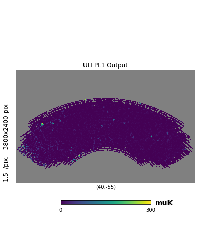
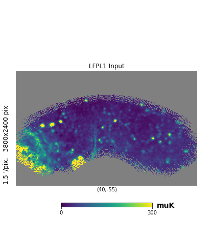 
 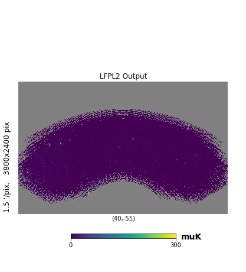
 
 
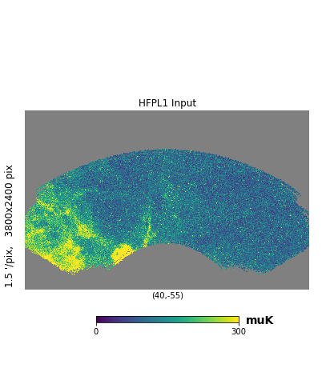 
 

## Polarization amplitude

 
 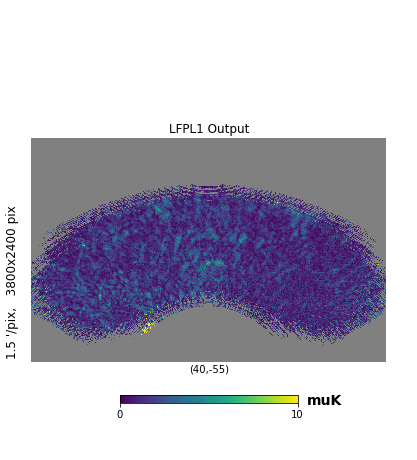
 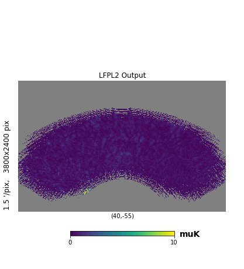
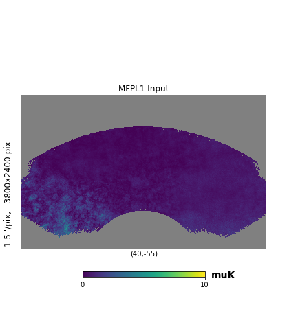 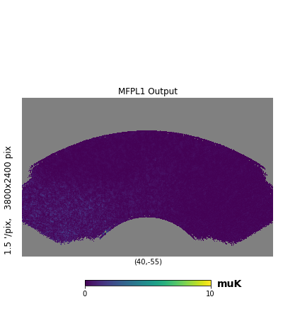
 
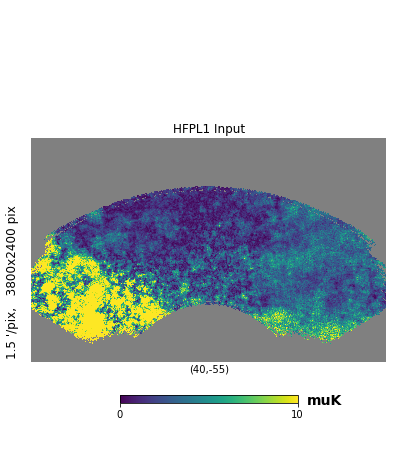 
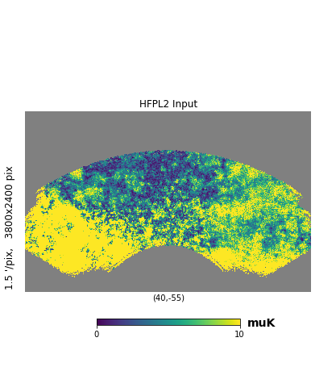 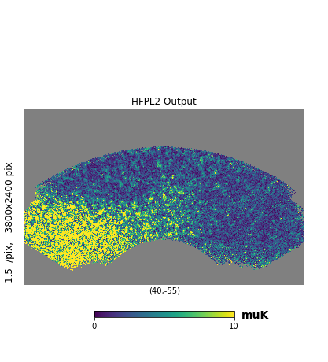
