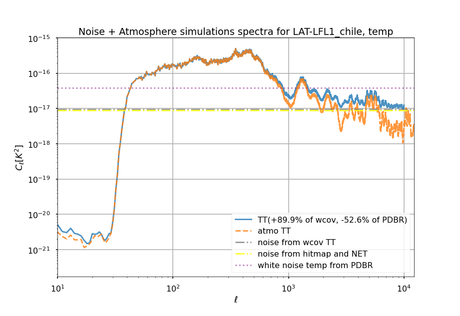
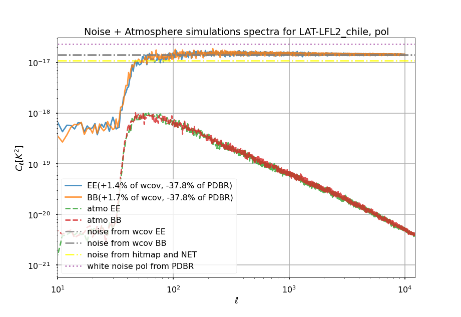
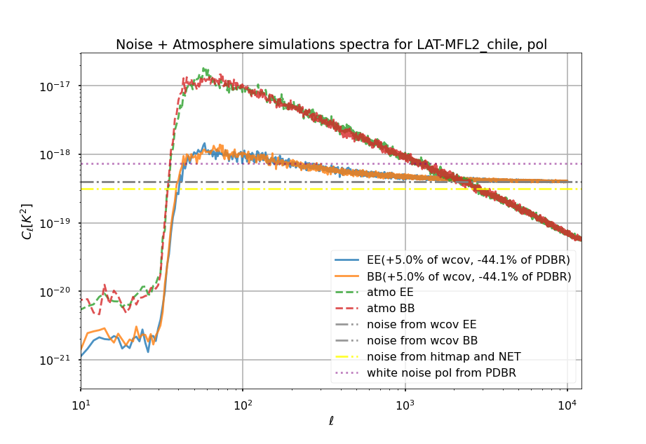

## Temperature

## Polarization

In Chile, the simulations include a sensitivity factor related to elevation, this factor is reflected in the white noise covariance matrices but not in the Hitmap+NET computation, so it is expected that they disagree.

